# Staging Interaction

\*\***NAME OF COLLABORATOR HERE**\*\*
COLLABORATOR: Xuesi Chen, Akash Basu, Sean Lewis, Benthan Vu, Carrie

In the original stage production of Peter Pan, Tinker Bell was represented by a darting light created by a small handheld mirror off-stage, reflecting a little circle of light from a powerful lamp. Tinkerbell communicates her presence through this light to the other characters. See more info [here](https://en.wikipedia.org/wiki/Tinker_Bell). 

## Prep

### To start the semester, you will need:
1. Read about Git [here](https://git-scm.com/book/en/v2/Getting-Started-What-is-Git%3F).
2. Set up your own Github "Lab Hub" repository by forking the [Interactive-Lab-Hub repository](https://github.com/FAR-Lab/Interactive-Lab-Hub). To get lab updates, simply [use GitHub's "Sync fork" button when new content is available](https://docs.github.com/en/pull-requests/collaborating-with-pull-requests/working-with-forks/syncing-a-fork).

3. Set up the README.md for your Hub repository (for instance, so that it has your name and points to your own Lab 1). You can [learn how to organize and format your README.md here](https://docs.github.com/en/get-started/writing-on-github/getting-started-with-writing-and-formatting-on-github/basic-writing-and-formatting-syntax). Make sure to include links to your submissions so they are easy to find.

### For this lab, you will need:
1. Paper
2. Markers/ Pens
3. Scissors
4. Smart Phone -- The main required feature is that the phone needs to have a browser and display a webpage.
5. Computer -- We will use your computer to host a webpage which also features controls.
6. Found objects and materials -- You will have to costume your phone so that it looks like some other devices. These materials can include doll clothes, a paper lantern, a bottle, human clothes, a pillow case, etc. Be creative!

### Deliverables for this lab are: 
1. 7 Storyboards
1. 3 Sketches/photos of costumed devices
1. Any reflections you have on the process
1. Video sketch of 3 prototyped interactions
1. Submit the items above in the lab1 folder of your class [Github page], either as links or uploaded files. Each group member should post their own copy of the work to their own Lab Hub, even if some of the work is the same from each person in the group.

### The Report
This README.md page in your own repository should be edited to include the work you have done (the deliverables mentioned above). Following the format below, you can delete everything but the headers and the sections between the **stars**. Write the answers to the questions under the starred sentences. Include any material that explains what you did in this lab hub folder, and link it in your README.md for the lab.

## Lab Overview
For this assignment, you are going to:

A) [Plan](#part-a-plan) 

B) [Act out the interaction](#part-b-act-out-the-interaction) 

C) [Prototype the device](#part-c-prototype-the-device)

D) [Wizard the device](#part-d-wizard-the-device) 

E) [Costume the device](#part-e-costume-the-device)

F) [Record the interaction](#part-f-record)

Labs are due on Mondays. Make sure this page is linked to on your main class hub page.

## Part A. Plan 

\*\***Describe your setting, players, activity and goals here.**\*\*

### Setting: 

The interaction takes place in a lively club environment. The “device” is imagined as part of the club’s lighting system, projecting colors onto a wall or ceiling to signal crowd activity. The time is during an event night when people are actively entering and leaving the space.

### Players:

Club guests who enter and exit the venue.

The interactive device (light system) that responds to the number of people inside.

### Activity:

As people enter or leave the club, the device flashes or changes colors to communicate the change in occupancy. The light system doesn’t just track individual events (entry/exit), but also communicates the current “state” of the crowd with color-coded signals:

Entry → white flash
Exit → black flash
Occupancy thresholds → black, green, yellow, red, or multicolor strobe.
Wave Hnad → light brightness/color saturation change.

### Goals:

Guests’ goal: enjoy the experience, understand crowd energy at a glance.

Device’s goal: translate occupancy into an intuitive light signal, keeping everyone aware of the club’s vibe.

\*\***Include pictures of your storyboards here**\*\*

Storyboard 1, 2, and 3
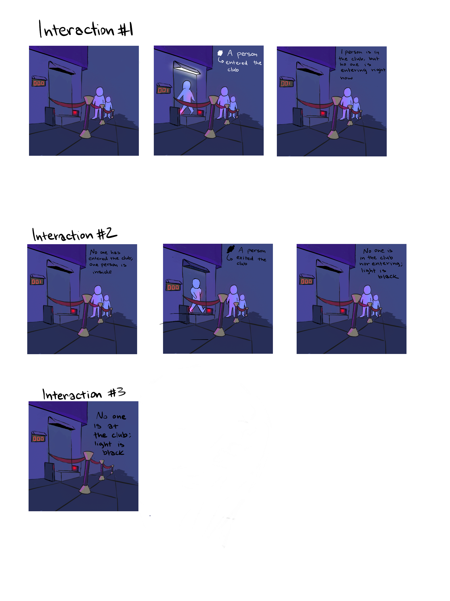

Storyboard 4 and 5
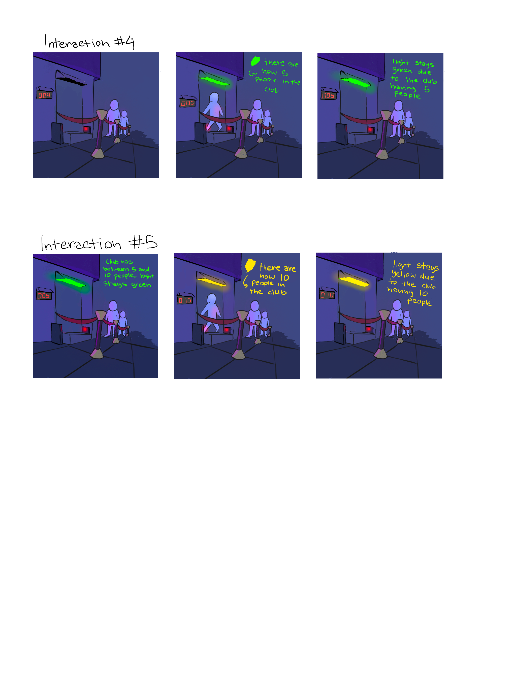

Storyboard 6 and 7
[Storyboard 6+7](storyboard6+7.pdf)

Storyboard 8
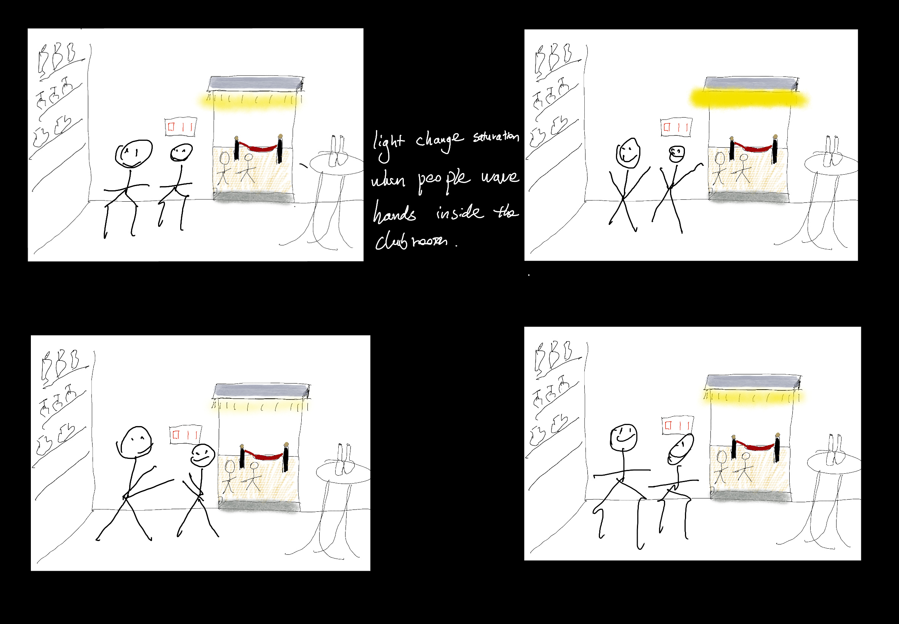

Present your ideas to the other people in your breakout room (or in small groups). You can just get feedback from one another or you can work together on the other parts of the lab.

\*\***Summarize feedback you got here.**\*\*

1. The flashing for entry/exit events could be distracting if too frequent; maybe consider smoother transitions or subtler effects.

2. Add more spatial features—for example, if people move to a corner of the room, the corresponding light could become brighter to indicate where the crowd is clustering.

## Part B. Act out the Interaction

Try physically acting out the interaction you planned. For now, you can just pretend the device is doing the things you’ve scripted for it. 

\*\***Are there things that seemed better on paper than acted out?**\*\*

1. On paper, the rapid flashes for entry/exit events seemed like a fun and clear signal. But when acted out, the flashes felt a bit too distracting and harsh, especially in quick succession. Similarly, the strobe effect at high occupancy looked more overwhelming than energizing in practice—it risked drawing attention away from the actual interaction.

\*\***Are there new ideas that occur to you or your collaborator that come up from the acting?**\*\*

1. Instead of sharp flashes, we could use gentler fades or pulsing lights for entry/exit to make the signals less disruptive.

2. We thought about adding spatial responsiveness, where the lights brighten in the direction or corner of the room that people move toward, giving more context than just occupancy counts.

## Part C. Prototype the device

\*\***Give us feedback on Tinkerbelle.**\*\*
Tinkerbelle is great, and congratulations to whoever developed it, but coming at this from a developer who used to love building things in Flask, I would recommend that you just shift it to a Github or CFPages webapp since 90% of the students probably aren't changing the source code of it. You can still keep the source code available and encourage students to play with it, however, you shouldn't need to make them setup any sort of Python venvs etc. (even if the reqs are minimal) to run your app. For our group, we ended up poking a hole thru the firewall with a temporary CF tunnel to have it be accessible to everyone else (since the school WiFi is pretty restrictive to what local webapps you can run). Can easily extend it to have some kind "rooms" functionality so that multiple different groups can use the app at same time

## Part D. Wizard the device
Take a little time to set up the wizarding set-up that allows for someone to remotely control the device while someone acts with it. Hint: You can use Zoom to record videos, and you can pin someone’s video feed if that is the scene which you want to record. 

\*\***Include your first attempts at recording the set-up video here.**\*\*

https://drive.google.com/file/d/1OGsV-xff_btzmd9VnCM2GJbxCDKisLvy/view?usp=drive_link

Now, change the goal within the same setting, and update the interaction with the paper prototype. 

\*\***Show the follow-up work here.**\*\*

https://drive.google.com/file/d/1biyKgNr6A_fNrD2bDSle_5IQODWIaXHP/view?usp=drive_link

## Part E. Costume the device

Only now should you start worrying about what the device should look like. Develop three costumes so that you can use your phone as this device.

Think about the setting of the device: is the environment a place where the device could overheat? Is water a danger? Does it need to have bright colors in an emergency setting?

\*\***Include sketches of what your devices might look like here.**\*\*

Prototype #1:

Prototype #2:

Prototype #3:

\*\***What concerns or opportunitities are influencing the way you've designed the device to look?**\*\*

### Concerns:
The interaction setting requires strong, noticeable lighting. This means the device either needs to achieve higher brightness levels or we may need to use multiple phones as light sources to ensure visibility in a larger or darker environment.

### Opportunitities 
The reliance on light opens up creative opportunities for expressive visual effects (color shifts, strobes, gradients) that can enhance the atmosphere. The device can also be scaled by adding more phones or light sources, turning a simple prototype into a flexible system for clubs, bedrooms, or events where light-based cues make the experience more engaging.

## Part F. Record

\*\***Take a video of your prototyped interaction.**\*\*

**Interaction 1**

**Interaction 2**

**Interaction 8**

**Music Credit: Seize the Day by Andrey Rossi** (edited) 

\*\***Please indicate who you collaborated with on this Lab.**\*\*

COLLABORATOR: Xuesi Chen, Akash Basu, Sean Lewis, Benthan Vu, Carrie

# Staging Interaction, Part 2 

This describes the second week's work for this lab activity.

## Prep (to be done before Lab on Wednesday)

You will be assigned three partners from other groups. Go to their github pages, view their videos, and provide them with reactions, suggestions & feedback: explain to them what you saw happening in their video. Guess the scene and the goals of the character. Ask them about anything that wasn’t clear. 

\*\***Summarize feedback from your partners here.**\*\*
Advise 1: The device would have more use case
Solution: We deploy the decive into other environment like park to increase utility.
Advice 2: There could be more costumes
Solution: we add more prototypes 

## Make it your own

Do last week’s assignment again, but this time: 
1) It doesn’t have to (just) use light, 
2) You can use any modality (e.g., vibration, sound) to prototype the behaviors! Again, be creative! Feel free to fork and modify the tinkerbell code! 
3) We will be grading with an emphasis on creativity. 

\*\***Document everything here. (Particularly, we would like to see the storyboard and video, although photos of the prototype are also great.)**\*\*

### Setting

The device is deployed in public spaces such as parks, playgrounds, or open squares. The environment is dynamic, with people entering and leaving, children playing, and community interactions occurring. Phones are integrated into the infrastructure, serving as both sensors (detecting movement, sound, and density) and light sources (communicating conditions through screen-based illumination).

### Players

Children and Families: Kids play in the park while parents or guardians supervise them.

General Visitors: People walking, resting, or exercising in the park.

Community Monitors/Authorities: Park staff, security, or even AI-assisted monitoring systems that interpret phone sensor data.

The Device: Acts as both a detector and a signaling system, translating real-time situations into visual light cues.

### Activities

#### Safety Monitoring

Detects when an unattended child leaves the park, triggering a red flashing signal.

Identifies potential fights through audio/motion sensors, again flashing red.

#### Entrance & Movement Tracking

Flashes briefly when someone enters the park, confirming detection.

#### Population Awareness

Adjusts light signals according to how crowded the park is:

Black: < 5 people

Green: 5–10

Yellow: 11–15

Red: 16–20

Rainbow: > 20

#### Community Feedback Loop

Provides real-time visual feedback for visitors about the current condition of the park.

Reinforces both safety awareness and capacity management.

### Goals

Safety: Prevent children from leaving unattended and detect dangerous events like fights quickly.

Awareness: Give park-goers an intuitive signal of how many people are present, reducing overcrowding risks.

Engagement: Create a sense of shared community responsibility by making safety and occupancy data visible to everyone.

Scalability: Show how simple tools (phones, lights, sensors) can be deployed across multiple public spaces with minimal infrastructure cost.

### Concerns 

1. Using phones as sensors raises privacy concerns (e.g., detecting children, fights, or crowd size). Parents and visitors may worry about constant monitoring.

2. Fight detection via sound/motion could confuse loud play, cheering, or sports activities as aggression.

3. Park visitors may resist the idea if they feel “watched” or if flashing lights feel intrusive.
   
### Opportunitities
1. Provides real-time visual alerts for emergencies (child leaving unattended, fights).
2. Can tie into broader smart city platforms for crowd management, safety, and urban planning.

### Storyboards:
Storyboard 1 -5
- 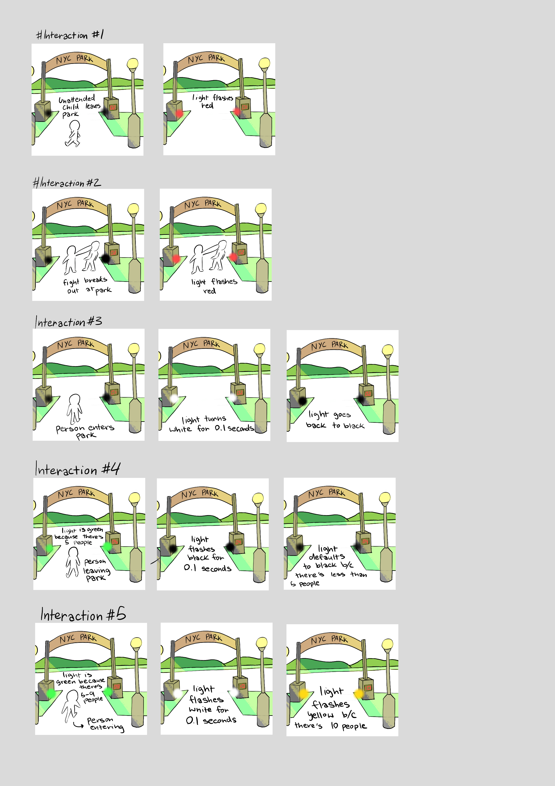
Storyboard 6-7
- 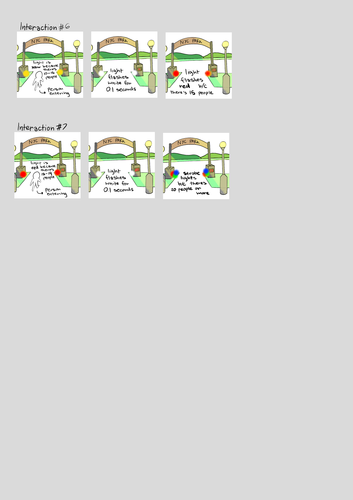

### Prototyped Interaction
- [lab1_2_1.mp4](lab1_2/lab1_2_1.mp4)
- [lab1_2_2.mp4](lab1_2/lab1_2_2.mp4)
- [lab1_2_3.mp4](lab1_2/lab1_2_3.mp4)

### Pictures for built prototypes
- 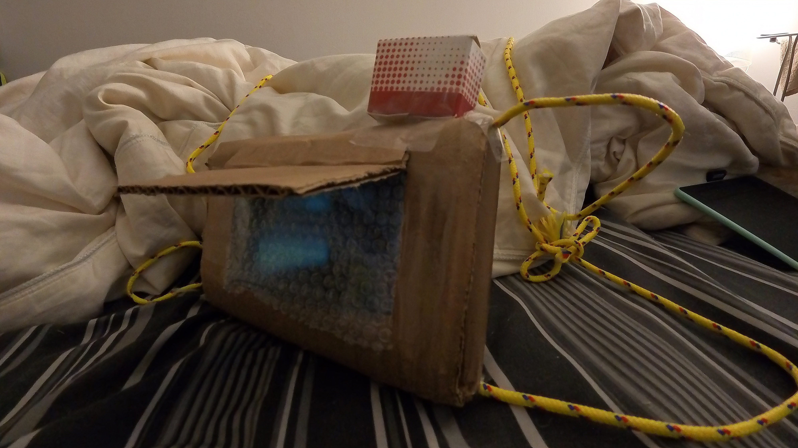
- 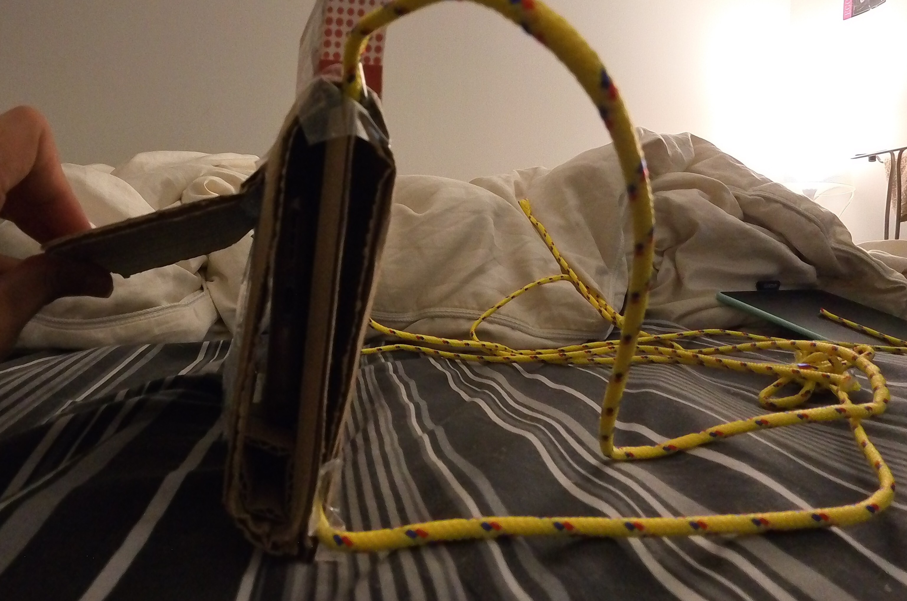
- 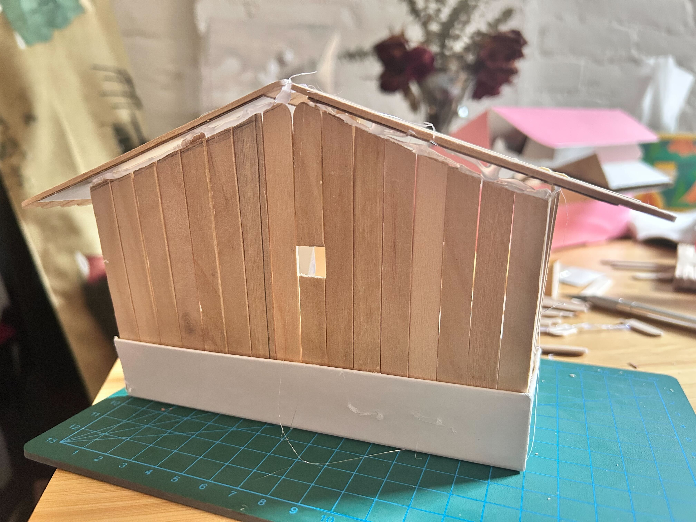
- 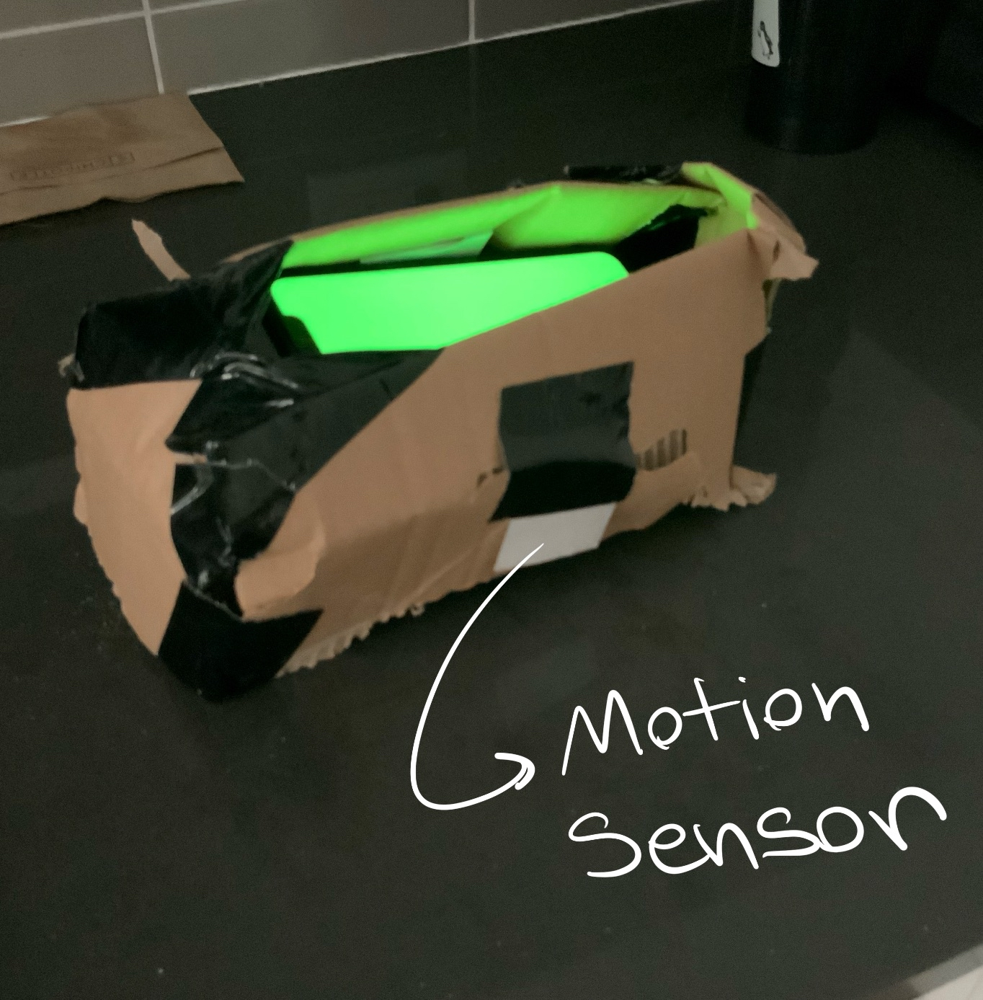
- 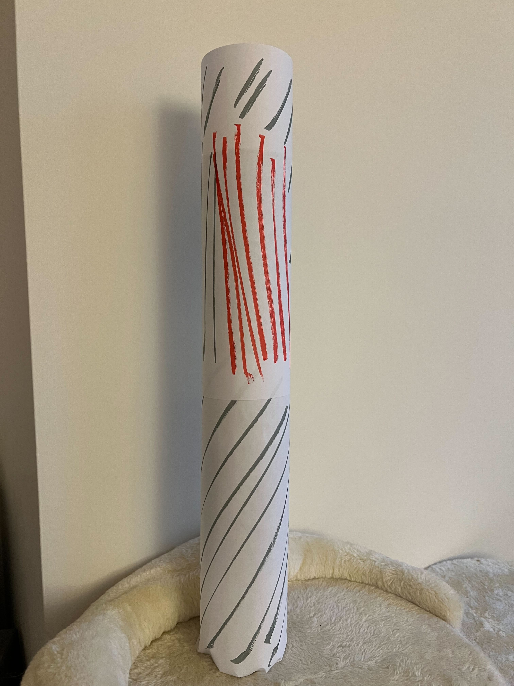

### Sketch of the prototypes
- 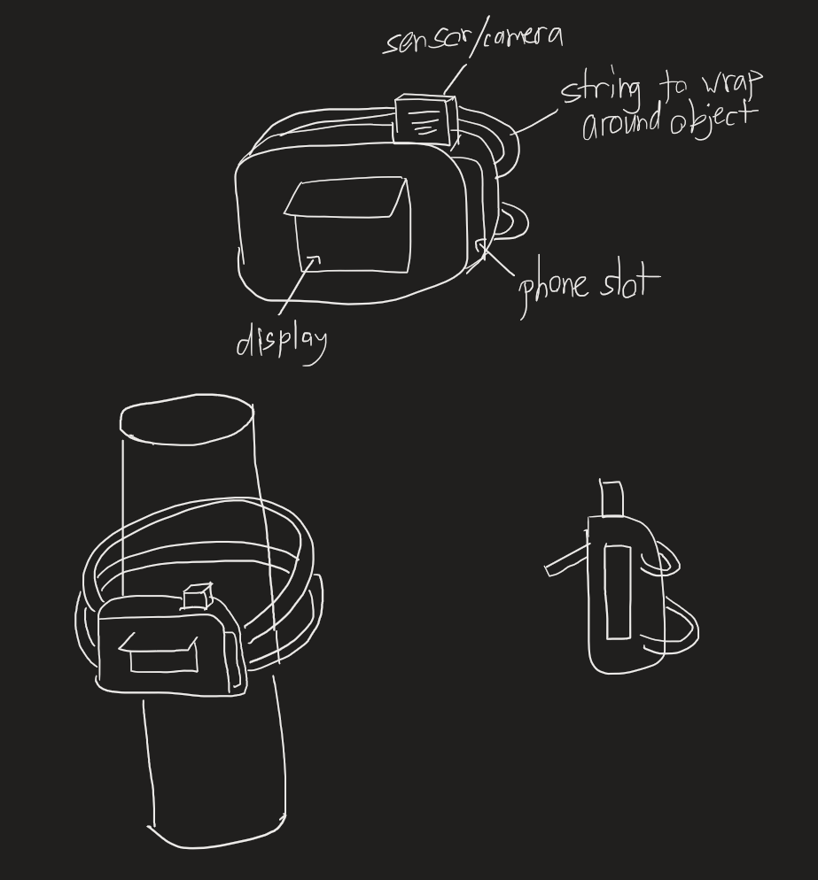
- 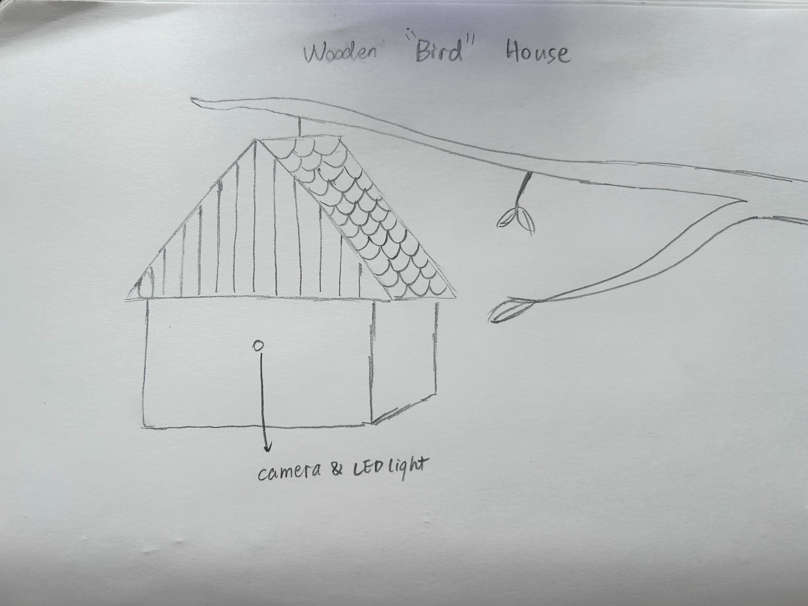
- 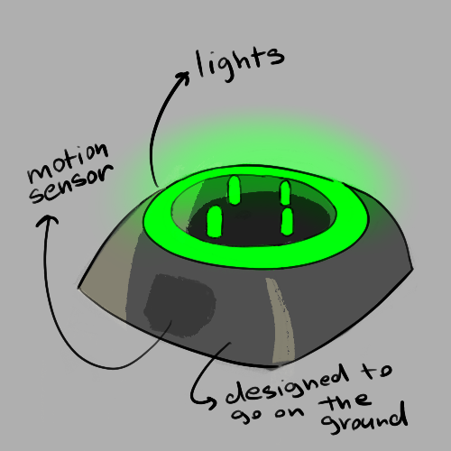
- 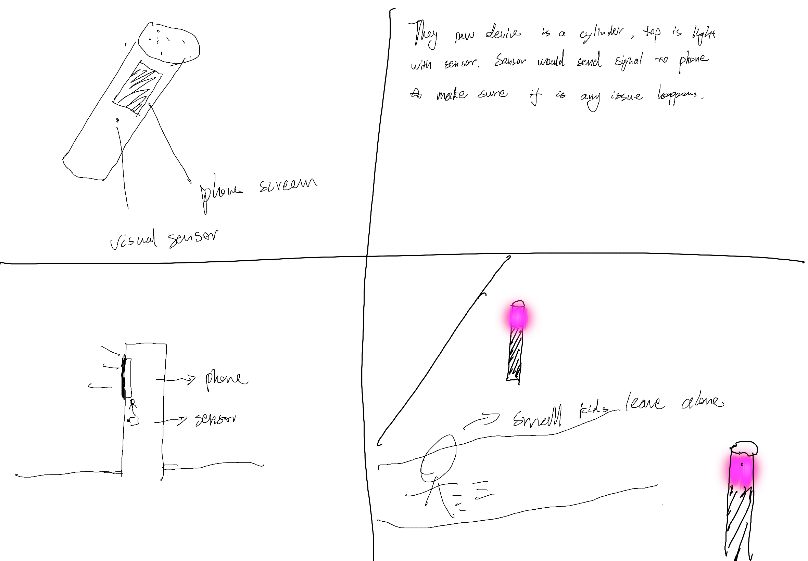

